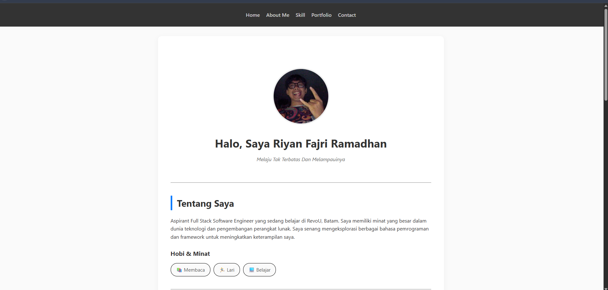

# Personal Portfolio - Riyan Fajri Ramadhan

**Milestone Project: Module 1 & 2 - Responsive Web Pages**

## 🌟 Overview

Website ini adalah portofolio pribadi yang dirancang untuk membangun _online presence_ saya sebagai **Aspirant Full Stack Software Engineer**. Proyek ini menunjukkan kemampuan saya dalam menyusun struktur web yang semantik serta menerapkan desain responsif menggunakan CSS modern.

## 🚀 Features

- **Semantic HTML5**: Menggunakan elemen struktur yang tepat untuk aksesibilitas dan SEO.
- **Responsive Design**: Layout yang beradaptasi dengan berbagai ukuran layar (Desktop & Mobile) menggunakan Media Queries.
- **Modern Layouting**: Implementasi **Flexbox** untuk navigasi dan penyelarasan elemen profil.
- **Interactive UI**: Efek hover pada kartu proyek dan navigasi untuk pengalaman pengguna yang lebih dinamis.
- **Functional Contact Form**: Formulir kontak dengan validasi dasar dan label aksesibilitas.

## 🛠️ Technologies Used

- **HTML5**: Struktur konten dan elemen semantik.
- **CSS3**: Styling, CSS Variables, Flexbox, dan Media Queries.
- **Google Fonts / Web Safe Fonts**: Tipografi yang bersih untuk keterbacaan yang optimal.
- **GitHub Pages**: Hosting dan deployment.

## 📸 Demo & Screenshots

- **Link Live Website**: [Klik di sini untuk melihat](https://github.com/Revou-FSSE-Feb26/milestone-1-Goodgame-Star.git)

| Desktop View                                  | Mobile View                                  |
| :-------------------------------------------- | :------------------------------------------- |
|  |  |

_(GAMBAR KETIKA MOBILE DAN TAMPILAN DEKSTOP)_.

## 📁 Project Structure

```text
.
├── Public/
|    └── Asset/          # Foto profil dan aset gambar
├── index.html           # Struktur utama website
├── style.css            # Styling dan desain responsif

```
